[TOC]

# 基于SimHash算法的文本相似度计算

个人 GitHub：https://github.com/ORonaldinhoO/Software-Engineering/tree/master

| 这个作业属于哪个课程 | https://edu.cnblogs.com/campus/gdgy/InformationSecurity1912-Softwareengineering |
| -------------------- | ------------------------------------------------------------ |
| 这个作业要求在哪里   | https://edu.cnblogs.com/campus/gdgy/InformationSecurity1912-Softwareengineering/homework/12146 |
| 这个作业的目标       | 1.设计一个论文查重算法；2.对其进行测试，分析性能并改进；3.撰写说明文档，介绍并总结 |

## 题目（需求）梳理

题目：论文查重

设计一个论文查重算法，给出一个原文文件和一个在这份原文上经过了增删改的抄袭版论文的文件，在答案文件中输出其重复率。

- 原文示例：今天是星期天，天气晴，今天晚上我要去看电影。
- 抄袭版示例：今天是周天，天气晴朗，我晚上要去看电影。

要求输入输出采用文件输入输出，且从**命令行参数**给出

注意：答案文件中输出的答案为浮点型，精确到小数点后两位。

除此之外，还需学习软件工程相关知识，包括制定PSP表格展示个人开发计划，介绍程序接口设计，对接口进行性能测试并改进，单元测试以及异常处理。

最后，学习Git相关知识，将项目代码及相关文件（包括说明）上传至GitHub。

## 查阅资料

词切分：语义切分、单个字切分，一般常用语义切分，并应考虑停用词（如：了、的、我）的影响。

将文本编码的方法有许多，由简到繁大致可以是

- 基于词频：one-hot、TF-IDF、simhash（哈希）
- 基于神经网络：word2vec(word embedding)->doc2vec、DMSS（Deep Structured Semantic Models）。

相似性度量：一般采用汉明距离、余弦相似度、欧氏距离等来评估相似度（cosine similarity）。

## 项目思路

本次项目从简单方式入手，首次开发先注重基本功能的实现，因此选用 google 提出的 simhash 算法，采用与其适合汉明距离进行度量。后续版本中，有意尝试对方法进行改进优化，也考虑采用其他算法。

### jieba库

jieba库是一款优秀的 Python 第三方中文分词库，支持三种分词模式：精确模式、全模式和搜索引擎模式，下面是三种模式的特点。

精确模式：试图将语句最精确的切分，不存在冗余数据，适合做文本分析。

全模式：将语句中所有可能是词的词语都切分出来，速度很快，但是存在冗余数据。

搜索引擎模式：在精确模式的基础上，对长词再次进行切分。

该项目中的程序采用精确模式对文本进行分词。

### SimHash算法

SimHash算法是Google在2007年发表的论文《Detecting Near-Duplicates for Web Crawling》中提到的一种指纹生成算法，被应用在Google搜索引擎网页去重的工作之中。简单的说，SimHash算法主要的工作就是将文本进行降维，生成一个SimHash值，也就是论文中所提及的“指纹”，通过对不同文本的SimHash值进而比较海明距离，从而判断两个文本的相似度。

- 算法思想

  局部敏感hash算法可以**将原始的文本内容映射为数字（hash签名）**，而且较为相近的文本内容对应的hash签名也比较相近。SimHash的**主要思想是降维**，通过将原始的文本映射为64位的二进制数字串，然后通过比较二进制数字串的差异进而来表示原始文本内容的差异。

- 算法流程

  1.分词；2.hash；3.加权；4.合并；5.降维。

  > 具体来说，假设，需要进行simhash的文本为：`“我很想要打游戏，但是妈妈会生气！”`；
  >
  > 首先，就是对文本进行分词操作，可以借助jieba库分词，结果为：`['我', '很', '想要', '打游戏', '游戏', '但是', '妈妈', '朋友', '会生', '生气']`；
  >
  > 然后，进行词频统计，得到：`{'会生': 1, '但是': 1, '妈妈': 1, '很': 1, '想要': 1, '我': 1, '打游戏': 1, '朋友': 1, '游戏': 1, '生气': 1}`;
  >
  > 然后，对以上每个词进行 HASH操作，比如md5，比如，`'会生'`的md5是 `f3ab426bf0c05aa49cd0903c31adcb38`，然后，以二进制位的方式，进行处理，如果 bit == 1，则 为 1x1；如果，bit == 0，则 为-1x1；
  >
  > 计算完，每一个词之后，将所有的结果按位相加，并生成唯一的HASH，结果为：`1459185014329402212`；
  >
  > 最后，对于不同文本，采用汉明距离对各自的哈希值进行度量，经公式可得出相似度。

## 计算模块

### 接口设计与实现

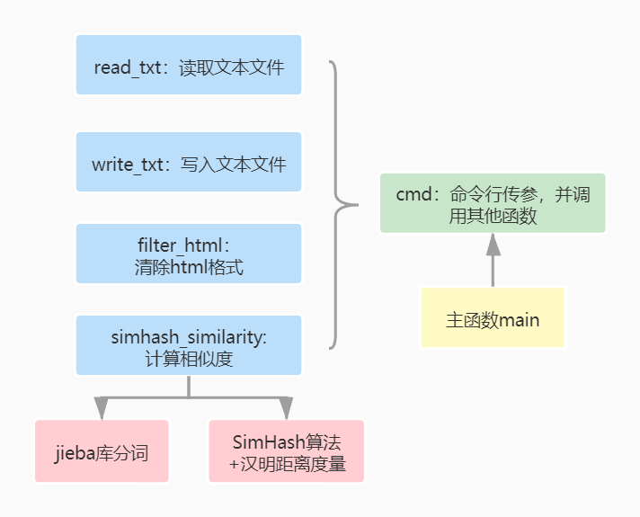

其中，考虑到部分测试样本中存在html格式的文本，对论文查重会有一定影响，因此实现一个采用正则表达式清除html格式的函数，即filter_html：

```python
def filter_html(html):
    """
    :param html: html
    :return: 返回去掉html的纯净文本
    """
    dr = re.compile(r'<[^>]+>', re.S)  # 正则表达式
    dd = dr.sub('', html).strip(' ')
    dd = dd.split()  # split后得到列表
    # print(dd)
    doc = ''
    for d in dd:
        d = d.strip()
        doc += d  # 字符串拼接

    return doc
```

经测试，添加该函数后，论文查重率有较大提升，整体约提升18%。

### 接口性能改进

#### 性能测试

由于PyCharm自带性能测试工具，为了进行测试，需稍改动代码，用程序内输入方式取代命令行传递参数的方式：

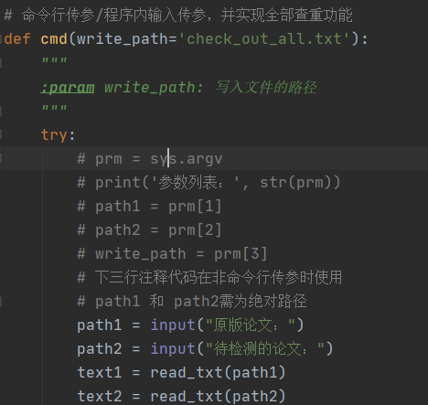

改动测试结果：

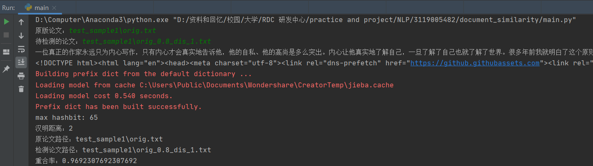

下面进行使用pycharm自带的profile功能进行性能测试：

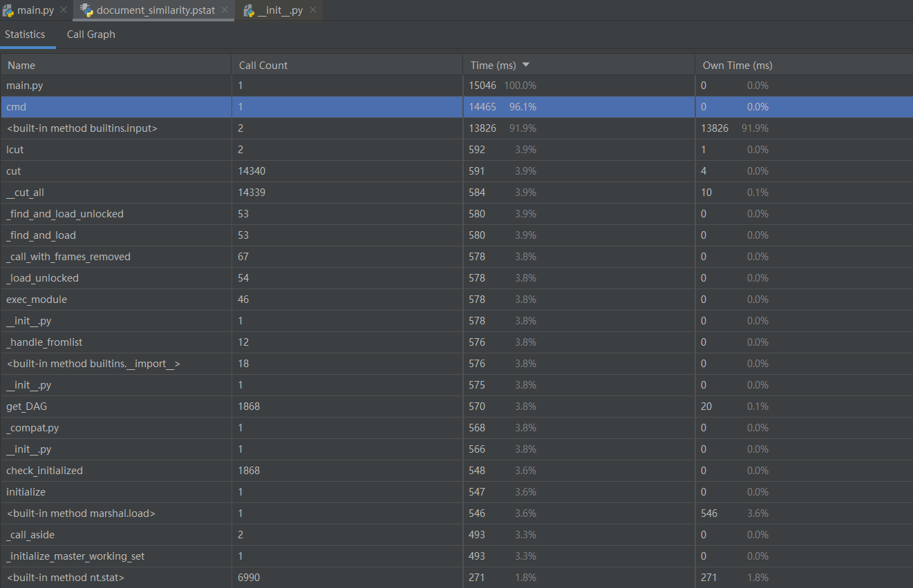

可见集成了所有其他函数的cmd函数运行时间最长，这在预料之中。另外，分词过程由于分词算法有一定复杂性，其运行时间在整体中也于前列。

内存测试：

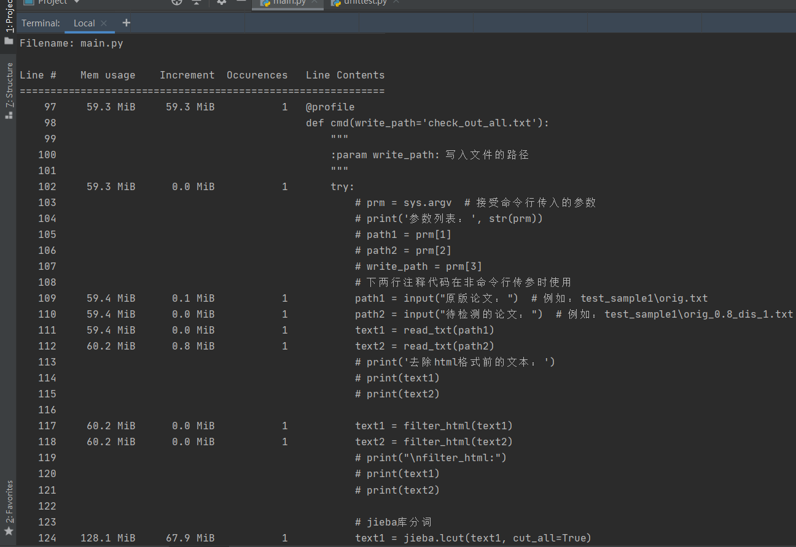

可见，调用一次程序占用的最大内存为128.1MiB，占用的内存并未超过2048MB。

#### 代码覆盖率

测试输出结果：

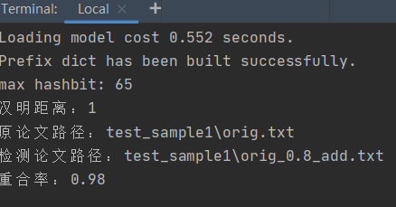

代码覆盖率：

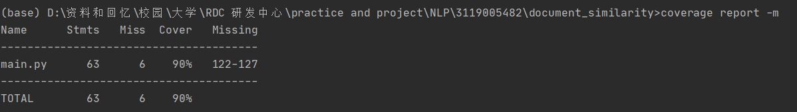

对应找到Missing所显示的代码所在行：

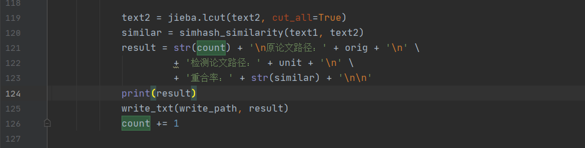

可见，程序结果已显示122-127行的输出内容，因此该部分实际上亦被覆盖，90+%的覆盖率可以说明该程序代码的一定合理性。

#### 改进之处

1.为了接口的稳定性，后续增加异常处理，避免程序报错。

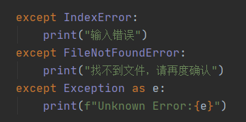

2.本算法基于词频，还并未涉及神经网络的前向传播这样复杂度更高的运算，且调用的相关库已经优化过，main.py中已尽量避免使用循环，其他暂时未想到可优化之处。

## 单元测试

### 实际需测试的单元

为自动化对每个单元进行测试，需要对原main.py代码进行修改。因此，对与实现交互的cmd函数进行修改，改动后代码如下：

```python
# 命令行传参/程序内输入传参，并实现全部查重功能
def cmd(write_path='unit_test.txt'):
    """
    :param write_path: 写入文件的路径
    """
    orig = 'test_sample1\orig.txt'  # 原版论文
    units = ['test_sample1\orig_0.8_add.txt', 'test_sample1\orig_0.8_del.txt', 'test_sample1\orig_0.8_dis_1.txt',
             'test_sample1\orig_0.8_dis_10.txt', 'test_sample1\orig_0.8_dis_15.txt','test_sample2\orig_0.8_add.txt',
             'test_sample2\orig_0.8_del.txt', 'test_sample2\orig_0.8_dis_1.txt', 'test_sample2\orig_0.8_dis_10.txt',
             'test_sample2\orig_0.8_dis_15.txt']  # 测试对象，包括两个文件夹下对应的测试样本
    try:
        text1 = read_txt(orig)
        text1 = filter_html(text1)
        text1 = jieba.lcut(text1, cut_all=True)

        count = 1
        for unit in units:
            print(count)
            # path1 = input("原版论文：")      # 例如：test_sample1\orig.txt
            # path2 = input("待检测的论文：")   # 例如：test_sample1\orig_0.8_dis_1.txt

            text2 = read_txt(unit)
            # print('去除html格式前的文本：')
            # print(text1)
            # print(text2)

            text2 = filter_html(text2)
            # print("\nfilter_html:")
            # print(text1)
            # print(text2)

            text2 = jieba.lcut(text2, cut_all=True)
            similar = simhash_similarity(text1, text2)
            result = str(count) + '\n原论文路径：' + orig + '\n' \
                     + '检测论文路径：' + unit + '\n' \
                     + '重合率：' + str(similar) + '\n\n'
            print(result)
            write_txt(write_path, result)
            count += 1

    except IndexError:
        print("输入错误")
    except FileNotFoundError:
        print("找不到文件，请再度确认")
    except Exception as e:
        print(f"Unknown Error:{e}")
```

对10个文件迭代测试，全部测试结果写入至另一个文本文件unit_test.txt，部分结果如下：


### 异常单元测试及处理

1.命令行传参格式不符合规范

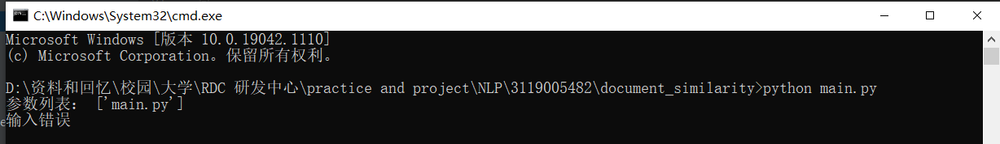

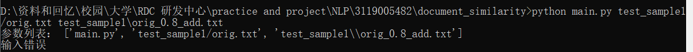

处理代码：

```python
    except IndexError:
        print("输入错误")
```

2.传参格式正确，但文件路径错误

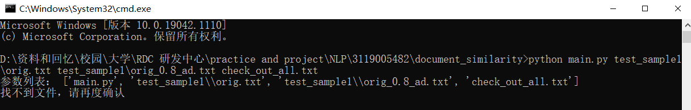

可以看到，参数列表中数目显示正确，但待检测的文件路径中应是add的拼写，而非ad。

处理代码：

```python 
    except FileNotFoundError:
        print("找不到文件，请再度确认")
```
3.其他可能的潜在错误

处理代码：

```python
    except Exception as e:
        print(f"Unknown Error:{e}")
```

## 命令行测试

代码改进后，进行命令行测试。部分结果如下，包括成功应对异常测试，以及将正确测试的结果写入新文件。

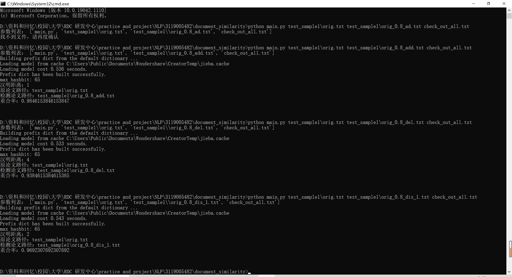

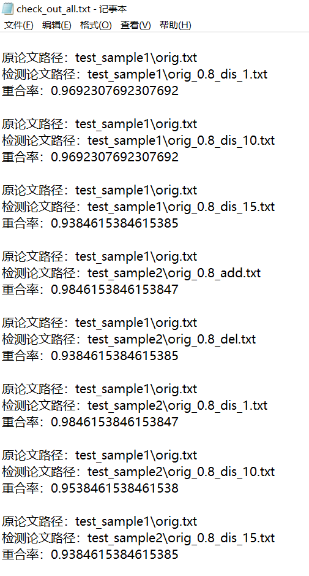

## 个人开发流程 PSP表格

| ***\*PSP2.1\****                        | ***\*Personal Software Process Stages\**** | ***\*预估耗时（分钟）\**** | ***\*实际耗时（分钟）\**** |
| :-------------------------------------- | ------------------------------------------ | -------------------------- | -------------------------- |
| Planning                                | 计划                                       | 15                         | 20                         |
| · Estimate                              | · 估计这个任务需要多少时间                 | 15                         | 20                         |
| Development                             | 开发                                       | 230                        | 250                        |
| · Analysis                              | · 需求分析 (包括学习新技术)                | 10                         | 10                         |
| · Design Spec                           | · 生成设计文档                             | 30                         | 40                         |
| · Design Review                         | · 设计复审                                 | 20                         | 20                         |
| · Coding Standard                       | · 代码规范 (为目前的开发制定合适的规范)    | 15                         | 15                         |
| · Design                                | · 具体设计                                 | 30                         | 30                         |
| · Coding                                | · 具体编码                                 | 80                         | 90                         |
| · Code Review                           | · 代码复审                                 | 15                         | 15                         |
| · Test                                  | · 测试（自我测试，修改代码，提交修改）     | 30                         | 30                         |
| Reporting                               | 报告                                       | 110                        | 150                        |
| · Test Repor                            | · 测试报告                                 | 70                         | 120                        |
| · Size Measurement                      | · 计算工作量                               | 20                         | 10                         |
| · Postmortem & Process Improvement Plan | · 事后总结, 并提出过程改进计划             | 20                         | 20                         |
|                                         | · 合计                                     | 355                        | 420                        |

## 总结

- 思考与实践
  - 方案的选择很关键，实现的算法有不少，最重要的是结合预留时间，个人能力，其他安排来选择。
  - 方案设计与落实之间的gap取决于自己的动手能力（代码能力），这次coding时间还是偏长了，平时还需多加练习，多手打代码。
  - 找debug常用方法：1.梳理程序结构；2.debug断点测试；3.利用print。
- 软件工程
  - 代码覆盖率有助于审视自己代码的紧凑性和整体性。
  - 性能测试很关键，一方面高性能能提高使用体验感；另一方面，寻求对代码的优化这一过程能增加自己的技术吧。
  - 做好异常处理，实际应用中总有太多意想不到的情况。

- 后续优化

  采用近年来工业界新兴且流行的神经网络，通过词/句嵌入和余弦相似度得到文本重合率。

## 参考文献

知乎：常见文本相似度计算方法简介 https://zhuanlan.zhihu.com/p/88938220

知乎：LSTM神经网络输入输出究竟是怎样的？https://www.zhihu.com/question/41949741/answer/318771336 

知乎：Kaggle知识点：文本相似度计算方法 https://zhuanlan.zhihu.com/p/349592491 

CSDN：自然语言处理 | (30) 文本相似度计算与文本匹配问题 https://blog.csdn.net/sdu_hao/article/details/95958293 

CSDN：NLP语义相似度计算的两大类方法（内含DSMM介绍）https://blog.csdn.net/jaygle/article/details/80927732 

CSDN：用于文本去重的Simhash https://blog.csdn.net/qq_44418077/article/details/114389678