[TOC]

# 结对项目

| **成员** | **学号**   | **GitHub地址**                                               |
| -------- | ---------- | ------------------------------------------------------------ |
| 张孟聪   | 3119005486 | https://github.com/Rushmmmc/TeamWork                         |
| 杨析睿   | 3119005482 | https://github.com/ORonaldinhoO/Software-Engineering/tree/master/partner |

## 程序设计

主程序流程图：

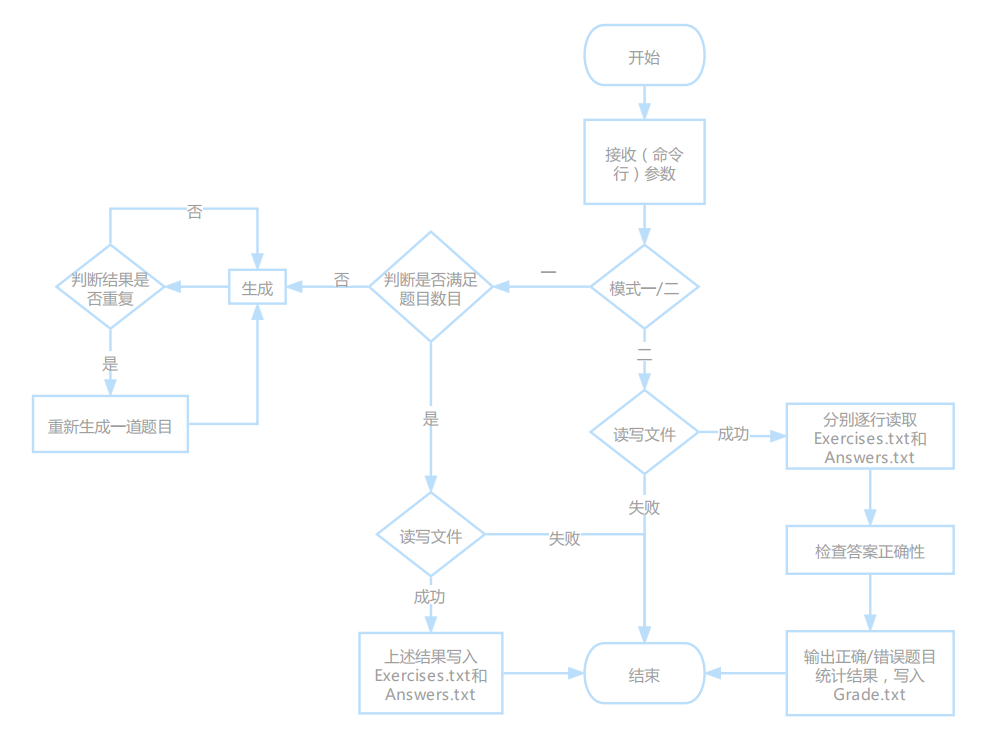

各模块关系图：

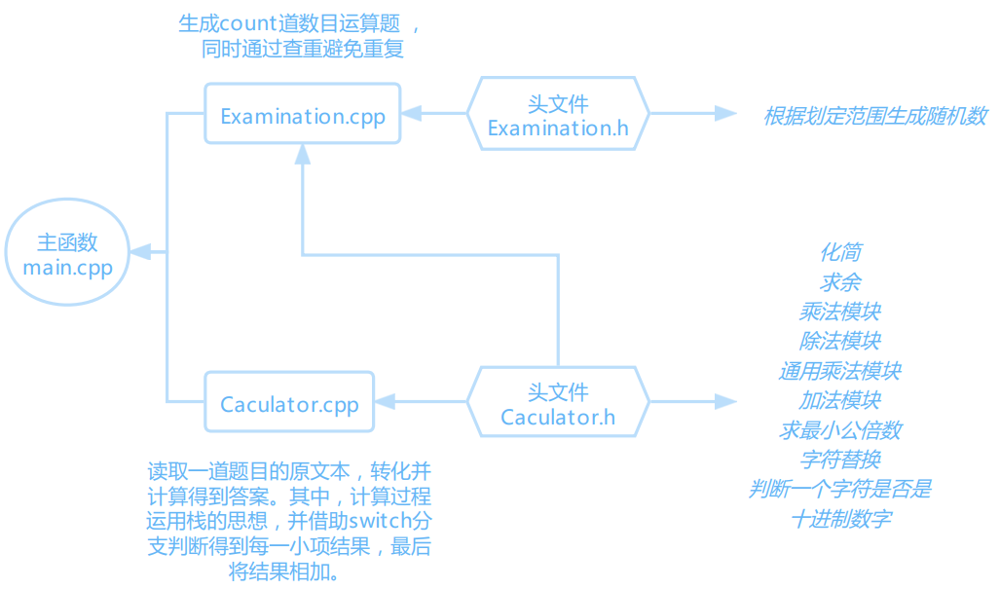

## 代码说明

### 关键部分

#### 除法处理

```c++
static void doDivideFraction(string& fraction1, const string& fraction2) {
    vector<string> temp2 = substring(fraction2, '/');
     doMultiplyFraction(fraction1, temp2[1] + "/" + temp2[0]);  // 转换成乘法 
  }
```

该部分通过substring()先将原分号去除，再调换被除数的分子分母，重新构成分数，从而将除法巧妙转换成乘法，然后借助通用乘法模块实现除法。

#### 通用乘法模块

```c++
static void doMultiplyFraction(string& fraction1, const string& fraction2) {
    vector<string> temp1 = substring(fraction1, '/');
    vector<string> temp2 = substring(fraction2, '/');
    // 分子
    int molecule1 = stoi(temp1[0]),molecule2 = stoi(temp2[0]);
    // 分母
    int denominator1 = stoi(temp1[1]), denominator2 = stoi(temp2[1]);
    int res1 = molecule1 * molecule2;
    int res2 = denominator1 * denominator2;
    fraction1 = to_string(res1) + "/" + to_string(res2);
  }
```

该部分通过subsrting()先将乘数和被乘数的分号去除，下一步提取出各自的分子和分母，分子相乘，分母相乘，组合成新的分数结果。

其中，stoi()将 n 进制的字符串转化为十进制,to_string将数字常量转换为字符串。

需要提及的是，这一部分最后并未进行化简处理。化简步骤放在最后所有运算小项相加得到结果时，这样即可一步处理到位。

#### 通用加法模块

```c++
static void doAddFraction(string& fraction1, const string& fraction2) {
    vector<string> temp1 = substring(fraction1, '/');
    vector<string> temp2 = substring(fraction2, '/');
    // 分子
    int molecule1 = stoi(temp1[0]),molecule2 = stoi(temp2[0]);
    // 分母
    int denominator1 = stoi(temp1[1]), denominator2 = stoi(temp2[1]);
    // 获得最小公倍数
    int multiple = getLeastCommonMultiple(denominator1, denominator2);
    int res = molecule1 * (multiple / denominator1) + molecule2 * (multiple / denominator2);
    fraction1 = to_string(res) + "/" + to_string(multiple);
```

该部分思想与通用乘法模块大体相似，只是多了获得最小公倍数的步骤，从而匹配加法结果。

#### 化简

```c++
 private:
  // 化简 
  static void simplyFraction(string& fraction) {
    vector<string> temp1 = substring(fraction, '/');  // 去除分号 
    string res;
    int m = stoi(temp1[0]), n = stoi(temp1[1]);
    int check = m / n;  // 以5/2为例 
    if (check >= 1) {
      res += to_string(check) + "'";
      m -= check * n;
    }
    if (m == 0)  {     // 如果除得尽，不需分数表示 
      fraction = to_string(check);
      return;
    }
    int gcd = getGcd(n, m);
    fraction = res;
    fraction += n / gcd == 1 ? to_string(m / gcd) : to_string(m / gcd) + "/" + to_string(n / gcd);  // 真分数形式的分数/带分数表示 
  }
```

该部分依然在去除分号后得到分子和分母。

先计算check值，若不小于1，结果为带分数或整数，res += to_string(check) + "'"便是添加（可能是带分数的）整数项。

下一步if(m==0)，判断原分子分母是否除得尽，除得尽则不需要分数表示。

最后，借助getGcd()求余数，并拼接计算结果，同时实现结果的化简。

#### 计算过程(Caculator.cpp)

```c++
#include "Calculator.h"

string Calculator::calculate(string text) {
  // 上一运算符 默认为+
  char mark = '+';
  const vector<string>& texts = substring(text, ' ');
  stack<string> numStack;
  string fraction;
  string num;
  string result;
  // 循环推进文本 
  for (int i = 0; i < texts.size(); i++) {
    string cur = texts[i];
    if(stringIsNum(cur)) {
      num = cur + "/1";
    }
    // 如果是分数
    else if (cur.size() >= 3){
      num = cur;
    }
    // 如果是运算符或者到达末尾
    if ((cur.size() == 1 && !stringIsNum(cur)) || i == texts.size() - 1) {
      switch (mark) {
        case '+': {
          numStack.push(num);
          break;
        }
        case '-': {
          numStack.push("-" + num);
          break;
        }
        case 'x': {
            multiplyFraction(num, numStack.top());
            numStack.pop();
            numStack.push(num);
          break;
        }
        case '/': {
          string temp = numStack.top();
          divideFraction(temp, num);
          numStack.pop();
          numStack.push(temp);
          break;
        }
        default: break;
      }
      mark = cur[0];
    }
  }
  // 整理数据栈，最后统一相加 
  while (!numStack.empty()) {
    // cout << numStack.top() << endl;
    addFraction(result, numStack.top());
    numStack.pop();
  }

  simplyFraction(result);  // 化简 
  return result;
```

前面提及的四个模块，均属于Caculator.h头文件中的模块组成，而Caculator.cpp通过引用头文件定义**一道题目的计算过程**。

大体步骤分为三步：

- 循环推进题目文本text
  - 判断是否为十进制数字，是则将其分数化
  - 判断是否为运算符或者到达末尾，
    - 是则再进行switch分支判断
      - 加减直接入栈，乘除先得到结果小项再入栈
      - 到达题目末尾，break跳出循环
    - 否则继续推进题目

- 整理数据栈，最后以逐个相加的方式（addFraction()上一结果与栈顶结果相加，再出栈），实现统一相加
- 化简最终结果并返回

#### 生成题目集并求解(Examination.cpp)

```c++
#include "Examination.h"
#include "Calculator.h"

unordered_map<int, char> Examination::operatorMap_ = {
        {1, '+'},
        {2, '-'},
        {3, 'x'},
        {4, '/'}
};  // 运算符 

// Examination::generate，生成count道数目运算题 
vector<std::string> Examination::generate(int count, int maxNum, vector<string>& results) {
  srand((int)time(0));
  // 用于判断结果是否重复 如果重复则重新生成
  unordered_set<string> checkResults;

  vector<std::string> examinations;
  for (int i = 0; i < count; i++) {
    // 生成本题目的运算符个数 最多3个
    int operatorCount = random(4);
    // 生成本题目分数个数
    int fractionCount = random(operatorCount + 2);
    // 分数所在位置的序列
    unordered_set<int> fractions;
    while (fractions.size() != fractionCount) {
      int fractionsIndex = random(operatorCount + 2) - 1;
      fractions.insert(fractionsIndex);
    }
    string curExamination;
    for (int j = 0; j < operatorCount + 1; j++) {
      // 本次需要插入的不是分数
      if (!fractions.count(j)) {
        curExamination += to_string(random(maxNum + 1));
      }
      else {
        curExamination += to_string(random(maxNum + 1)) + "/" + to_string(random(maxNum + 1));
      }
      // 最后一轮不需要再加操作运算符了
      if (j != operatorCount) {
        curExamination += " ";
        curExamination += operatorMap_[random(5)];
        curExamination += " ";
      }
    }
    // 对这一道题目求解 
    string examinationRes = Calculator::calculate(curExamination);
    // 查重
    bool flag = checkResults.count(examinationRes);
    // flag为true就重复了，不需要再次添加该题信息 
    if (flag) {
      i--;
      continue;
    }
    // 不重复则添加题目信息和对应答案 
    else {
      examinations.push_back(curExamination);
      checkResults.insert(examinationRes);
      results.push_back(examinationRes);
    }
  }
  return examinations;
}
```

指定题目数量和数值范围，主要通过一个外层for循环一一生成题目，生成完每一道题目后立即查重，不重复再添加信息。

### 亮点

1.编程语言选择高性能的**C++**，在C的基础上增加面向对象的特点，代码可读性好，同时在方便使用现有类的基础上，具有更小的内存资源消耗，提高运行速度；

2.一般的数值运算需要两个栈。**该程序优化后只需用一个数据栈**，记录每次运算的前一个操作符和当前操作符，因为操作符的优先级只发生在前一个和当前，只用记录这两个即可保证运算的正确性，具体做法是按比较两个操作符的优先级来处理；

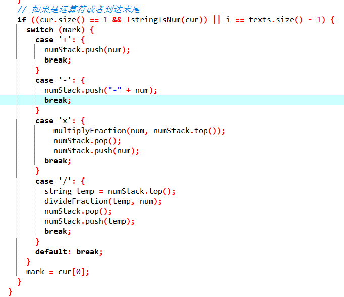

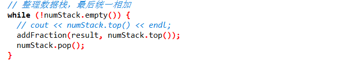

3.**模式选择**步骤加入异常处理，防止因命令行传参造成的程序错误，

4.文件读取环节添加**异常处理**。

### 异常处理

#### 模式选择

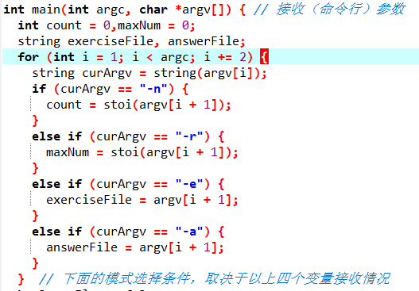

**模式选择取决于命令行传递的参数。**

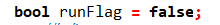

runFlag: 布尔类型标志变量。

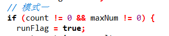

**第一个if**，如果成立，runFlag为真，模式一激活。

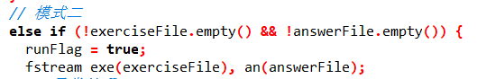

**相应的else if，模式一与模式二对立**，runFlag为真，模式二激活。

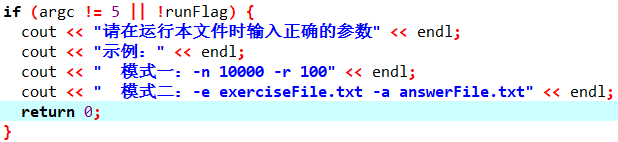

**第二个if，当传递参数不合规或runFlag为假时**，提示重新在命令行传参，程序结束。

#### 文件读取

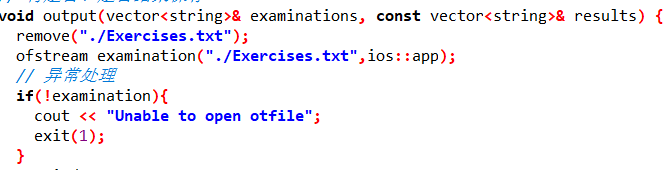

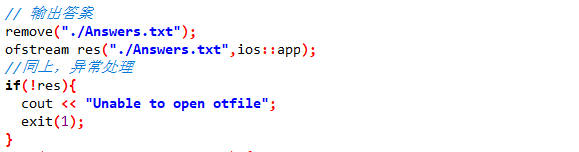

如果文件读取为空，则提前提示并退出。

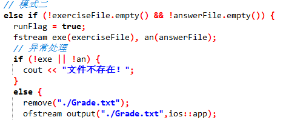

尽管else if语句已经判断了非空，但为了避免打开失败，再做一次判断，可提前提示文件不存在。

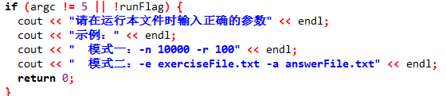

传参不合规的提示。

## 效能分析与改进

效能分析时输入的参数：


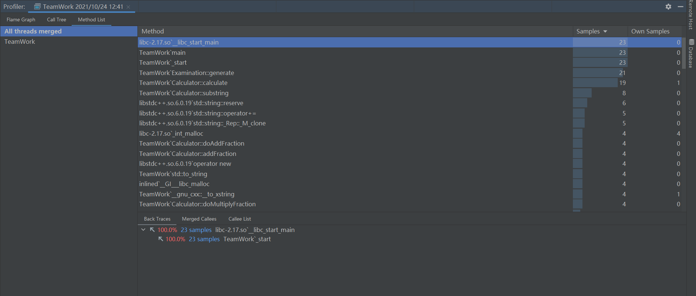

调用树：

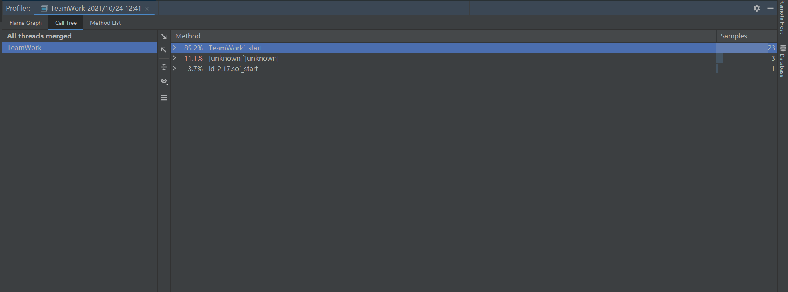

Flame Graph（火焰图）：

all: 

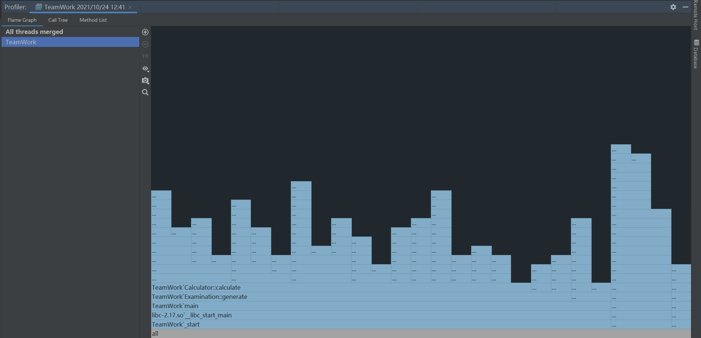

caculate: 

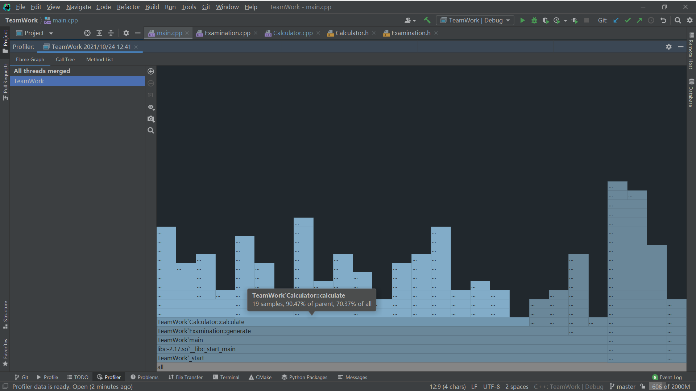

generate: 

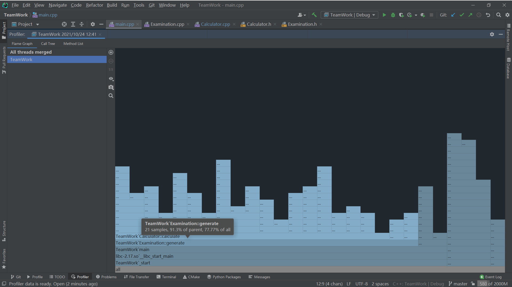

main: 

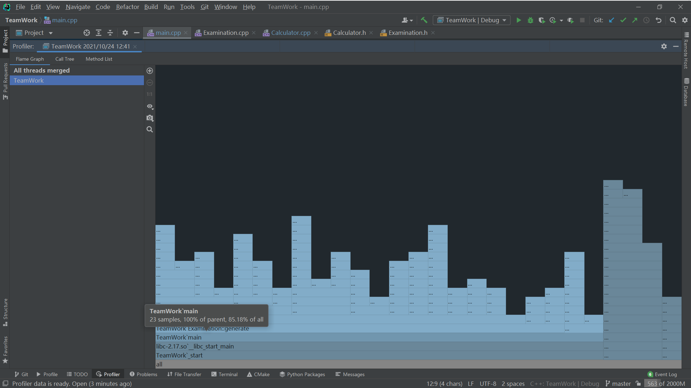

可以看到，由Caculator::caculate到Examination:: generate再到main，占用率越来越高，符合程序各部分关系图所描述的情况。

## 测试运行

正确输入规范：

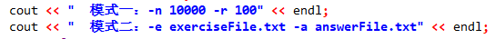

其中，模式一中n表示题目数目，r表示最大数值。


样例一

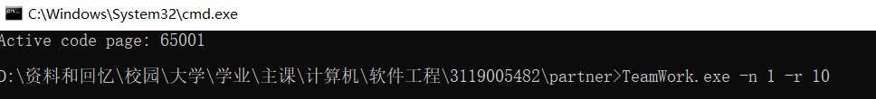

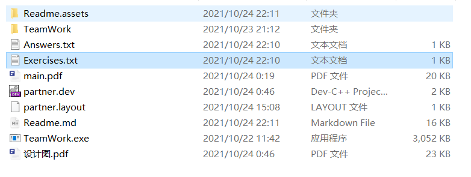

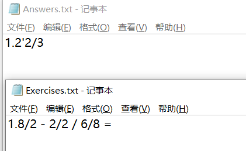

题目根据要求成功生成，解答结果经验证正确，成功保存至文件。


样例二

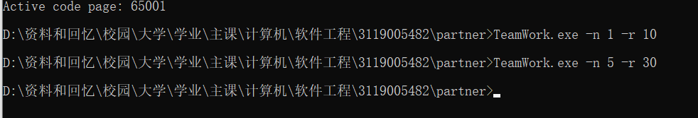

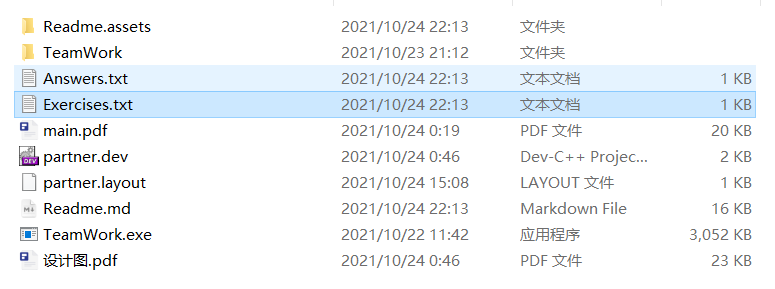

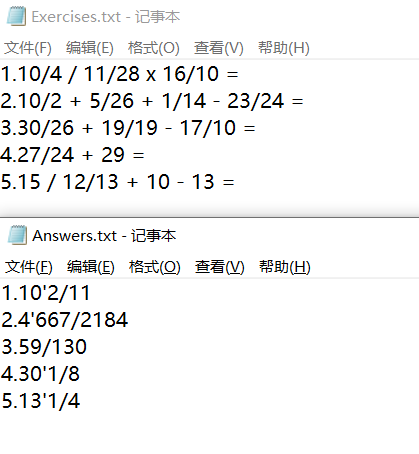

题目根据要求成功生成，解答结果经验证正确，成功保存至文件（重新覆盖之前的文件）。


样例三


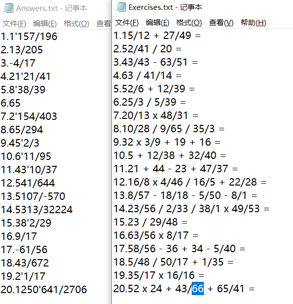

题目根据要求成功生成，解答结果经验证正确，成功保存至文件（重新覆盖之前的文件）。


样例四

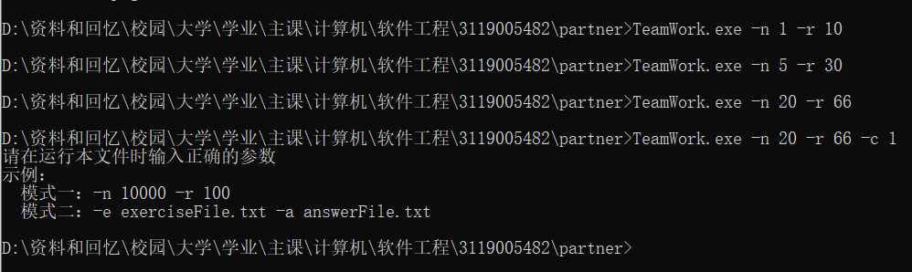

输入不合规，提示重新输入。


样例五

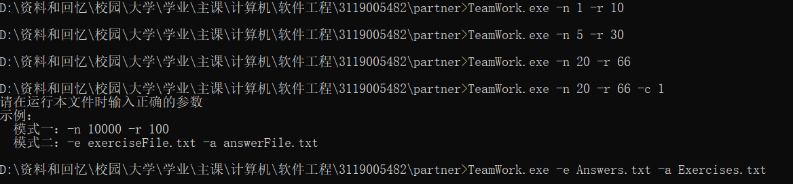

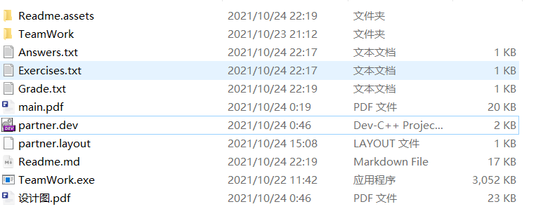

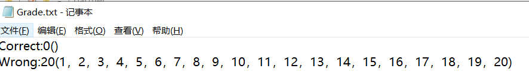

检测至模式二，对题目及其结果验证，并统计正确/错误信息，成功保存至文件。


样例六

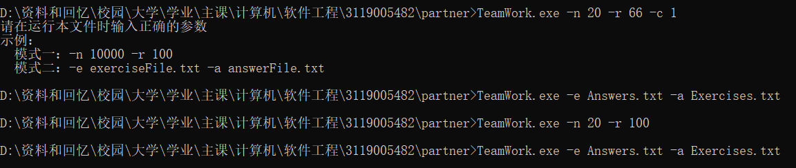

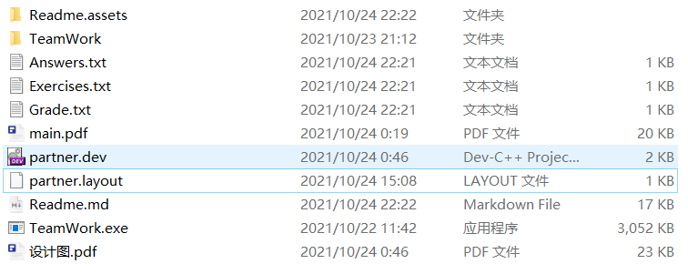

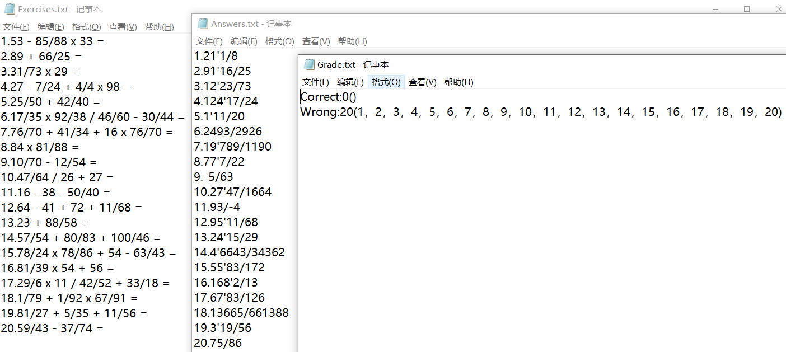

先模式一重新生成题目和结果，再选择模式二，对题目及其结果验证，并统计正确/错误信息，成功保存至文件（重新覆盖之前的文件）。


样例七

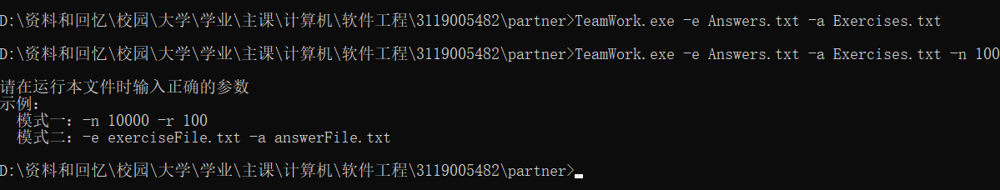

输入不合规，提示重新输入。


样例八

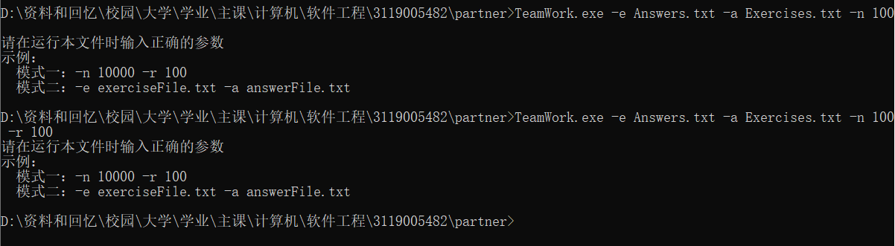

输入不合规，提示重新输入，验证了模式一和模式二的区分。


样例九

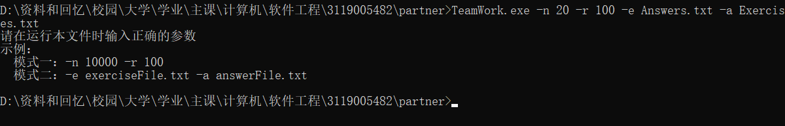

输入不合规，提示重新输入，验证了模式一和模式二的区分。


样例十

将结果文件内容清空：


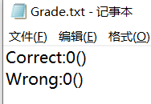

*因为解答为空，所以无法验证正确/错误情况，与预期一致。*


样例十一

模式二中特意输入错误的文件名参数：

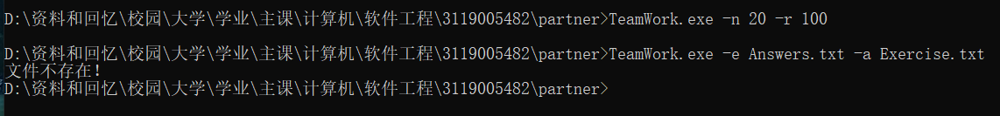

应该是Exercises.txt，而非Exercise.txt。检测到文件不存在，异常处理成功。

## PSP表格

| ***\*PSP2.1\****  | ***\*Personal Software Process Stages\**** | ***\*预估耗时（分钟）\**** | ***\*实际耗时（分钟）\**** |
| ----------------- | ------------------------------------------ | -------------------------- | -------------------------- |
| Planning          | 计划                                       |                            |                            |
| · Estimate        | · 估计这个任务需要多少时间                 | 30                         | 30                         |
| Development       | 开发                                       | 490                        | 450                        |
| · Analysis        | · 需求分析 (包括学习新技术)                | 200                        | 100                        |
| · Design Spec     | · 生成设计文档                             | 30                         | 30                         |
| · Design Review   | · 设计复审 (和同事审核设计文档)            | 20                         | 20                         |
| · Coding Standard | · 代码规范 (为目前的开发制定合适的规范)    | 10                         | 10                         |
| · Design          | · 具体设计                                 | 50                         | 50                         |
| · Coding          | · 具体编码                                 | 30                         | 20                         |
| · Code Review     | · 代码复审                                 | 30                         | 20                         |
| · Test            | · 测试（自我测试，修改代码，提交修改）     | 40                         | 30                         |
| Reporting         | 报告                                       | 20                         | 20                         |
|                   | · Test Report                              | · 测试报告                 | 20                         |

## 项目小结

### 项目收获

1.花费的时间比想象的要长，说明思路想法和代码工程的互通难免遇到问题，因此除了加强自身代码能力，还要提前预留好时间和策略；另外，本次合作暂未用到git的分支管理，下次可以学习。

2.技术选型上使用了C++语言，排查了一些内存泄漏问题以及空悬指针问题，收获良多；

3.多次commit的敏捷开发能快速反馈，没必要第一次就追求完整完善。根据想法快速地初步落实好，再从这一次提交的结果出发，可以让思路、存在问题、优化方向更清晰；

4.项目的最后开发阶段，鼓励在算法、性能方向进行优化，思考有没有更高效率的代码实现；

5.git语法记录：1. git rm * --cached：清空暂存区所有缓存；2.git reset --soft HEAD^，撤销未push的commit，例如git reset --soft HEAD~2为撤销回到前两个版本。

### 结对感受与相互建议

张孟聪：

这次结对项目我主要负责代码设计，感觉还是有不少的收获的，一开始看到题目感觉比较简单，但是真正要实现维持分数的而不是浮点数才发现有很多麻烦的事情。这次和队友合作总体比较愉快，使用C++进行开发真的很nice。

杨析睿：

这次自己主要是辅助，更多地参与代码检查和文档撰写。其实一开始自己也可以和搭档共同探讨实现思路，但本次这一点做的并不是很好。代码检查方面，要多向搭档确认好代码功能，避免理解偏差，有建议就及时指出。文档撰写方面，设计、代码说明、测试等等都应有所说明，同时语言表达要简明清晰，这样文档才具备良好可读性。

对于搭档，自己的搭档代码能力很强，代码规范和相关注释也做的很到位，他的开发能力是自己需要学习的地方。另外，搭档对细节的一些优化处理也值得自己品味学习，例如计算部分从两个栈简化到单个栈的优化。

最后，结对项目需要两个人多沟通，保持联系，以提高项目开发效率和完整度。


